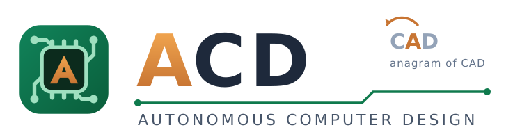
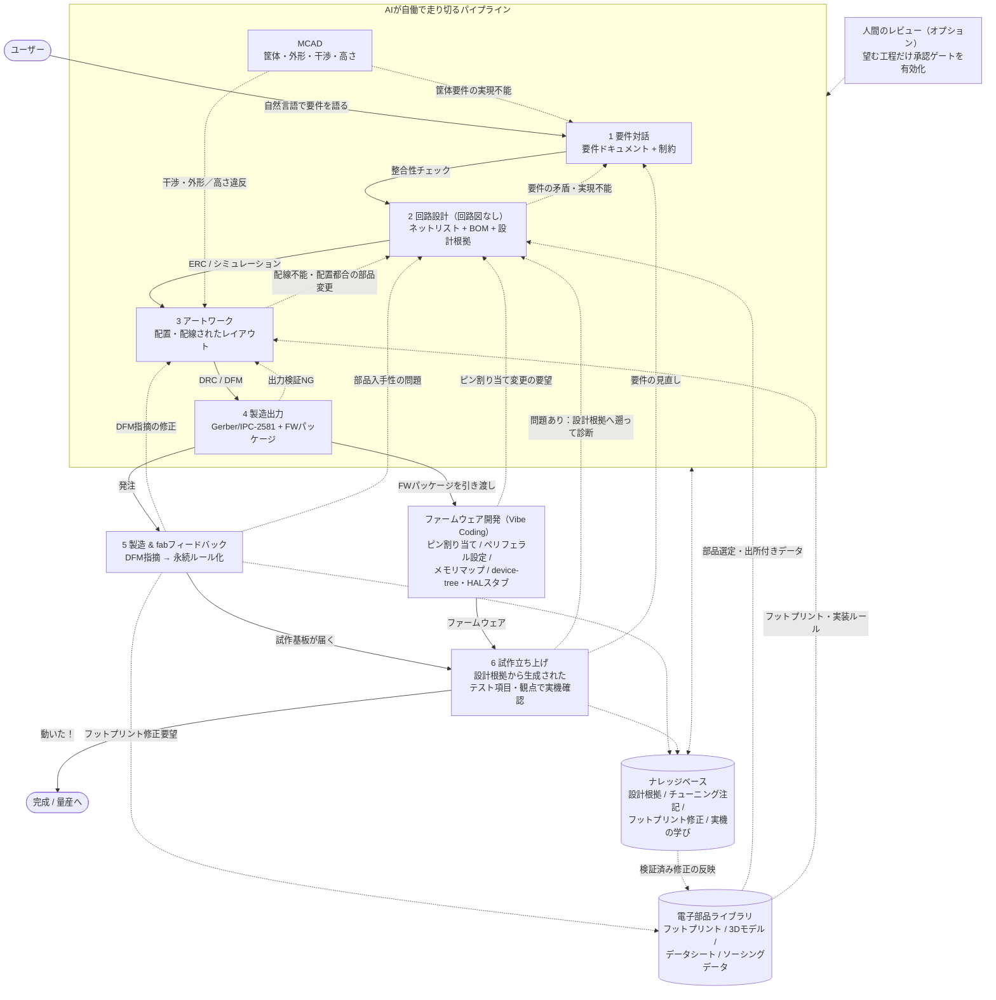

# ACD — Autonomous Computer Design

**ブラウザ上で完全に動作する、プリント基板設計のためのAIファーストCAD。**

ACDは、従来のEDAモデルを反転させます。AIアシスタントを後付けした回路図／レイアウトエディタを人間が操作するのではなく、**AIが主たる設計者**となります。AIはユーザーへのヒアリング、部品選定、回路とアートワークの設計、製造データの生成、工場や試作からのフィードバックを受けた反復までを担い、人間は要件のオーナーとして関わり、必要に応じてレビュアーの役割も担えます。すべての工程で知識が蓄積されるため、設計する基板が増えるほどシステムは賢くなります。ACDという名称はCADのアナグラムであり、役割を人間主体からAI主体へ反転することを象徴しています。

ACDが実現するこの新しいAIセントリックな基板開発スタイルを、私たちは **VibeBB（Vibe BreadBoarding）** と呼びます。

> ステータス：コンセプト段階。このドキュメントでは、ビジョン、設計フロー、アーキテクチャの方向性を定義します。実装はまだありません。
>
> 初期ターゲット：趣味〜小規模プロトタイピング（1〜4層のリジッド基板）。高密度多層・フレキシブル・認証が必要な量産設計は将来の拡張領域とします。

**目次：** [VibeBB](#vibebb--vibe-breadboarding)・[1 なぜACDか](#1-なぜacdか)・[2 設計フロー](#2-設計フロー--6つのステップ)・[3 知識の蓄積](#3-知識の蓄積)・[4 アーキテクチャ](#4-アーキテクチャの方向性)・[5 ACDではないもの](#5-acdではないもの)・[6 先行事例調査](#6-先行事例調査)・[7 ロードマップ](#7-ロードマップ)・[8 将来展望](#8-将来展望--家庭で基板を印刷する時代へ)・[9 長時間タスクを走り切る実行基盤](#9-長時間タスクを走り切る実行基盤)・[10 開発の進め方](#10-開発の進め方--aiと共に作るacd)

---

## VibeBB — Vibe BreadBoarding

**VibeBB** は、「Vibe Coding」になぞらえた造語です。Vibe Codingは、Andrej Karpathyが[2025年2月の投稿](https://x.com/karpathy/status/1886192184808149383)で提唱した概念で、「完全にバイブスに身を委ね、コードの存在すら忘れる（fully give in to the vibes, embrace exponentials, and forget that the code even exists）」と表現されました。自然言語でやりたいことを伝え、結果を見て、また伝える——「see stuff, say stuff, run stuff」という対話的・結果駆動のループで、実装の詳細はAIに委ねる開発スタイルです。この言葉は急速に普及し、[Collins英語辞典の2025年Word of the Year](https://blog.collinsdictionary.com/language-lovers/collins-word-of-the-year-2025-ai-meets-authenticity-as-society-shifts/)にも選ばれました。

VibeBBは、この体験を電子回路基板の世界に持ち込みます。ブレッドボード（BreadBoard）がハンダ付けなしに「考えながら試す」ことを可能にしたように、VibeBBではやりたいことを言葉で伝えるだけで、AIが部品選定・回路設計・アートワークまでを進め、人間は結果（動く試作基板）を見てフィードバックを返します。回路図を描かないことは、コードを読まないVibe Codingと対になる発想です。

このスタイルを支えるのは、基板製造のコストとリードタイムの革新的な低下です。（JLCPCBに代表される安価・短納期の製造サービスなど。）VibeBBはこの前提に立ち、長時間の机上検討よりも「まず作って実機で確かめ、すぐ次のリビジョンを回す」ことを基本サイクルとします。

したがってVibeBBは、Vibe Codingと同じく**人間のレビューや承認を前提としません**。デフォルトでは、要件を伝えればAIが発注可能な製造データまで一気に進み、あらかじめ予算上限を設定しておけば、その範囲内でfabへの発注まで自働で実行できます（異常があれば自ら止まって人に知らせる——[設計原則](#設計原則)参照）。品質を担保するのは人間の目ではなく、決定論的な自動検証ゲート（ERC/DRC/シミュレーション/DFM）と、全工程で自動記録される設計根拠です。人間によるアートワークレビューや承認ポイントは**オプション**であり、見たい人だけが、見たい工程だけをレビューすれば十分です。実機で問題が出たときは、残された設計根拠を手がかりに対話で修正を指示すれば、AIが次のリビジョンを作ります。なお、Simon Willisonは[本来のVibe Coding（生成物をレビューしないスタイル）とレビューを伴うAI活用を区別すべき](https://simonwillison.net/2025/Mar/19/vibe-coding/)と論じましたが、VibeBBはレビューの役割を人間から自動検証と実機テストへ移すことで、バイブスのままでも安心して基板を作れることを目指します。

VibeBBのループは次のとおりです：**語る（要件を伝える）→ AIが設計し自動検証する → 作って試す（製造・実機テスト）→ フィードバックが知識として蓄積される**。見て確かめる（アートワークレビュー）はいつでも挟めますが、必須ではありません。ブレッドボードの気軽さで基板を回し、知識の蓄積によって量産品質へ到達できることを目指します。

---

## 1. なぜACDか

従来のPCB CAD（KiCad、Altium、EasyEDA、…）は、人間が回路図を描き、それをレイアウトへ移し、手作業で配線することを中心に構築されています。既存ツールのAI機能も、この人間中心のワークフロー内で動くアシスタントです。

[§6](#6-prior-art-survey)の先行事例調査からは、3つの潮流と、その間にあるギャップが見えてきます。

1. **コードとしての設計**（[diodeinc/pcb (Zener)](https://github.com/diodeinc/pcb)（[DeepWiki](https://deepwiki.com/diodeinc/pcb)）、[atopile](https://github.com/atopile/atopile)（[DeepWiki](https://deepwiki.com/atopile/atopile)）、[tscircuit](https://github.com/tscircuit/tscircuit)（[DeepWiki](https://deepwiki.com/tscircuit/tscircuit)）、[JITX](https://www.jitx.com/)）は、構造化され差分比較可能な設計表現が、不透明なGUIの状態よりもソフトウェア、そしてAIにとってはるかに操作しやすいことを示しています。
2. **ブラウザ／AI製品**（[Flux.ai](https://www.flux.ai/p)、[CELUS](https://www.celus.io/)、[Quilter](https://www.quilter.ai/)）は、インストール不要のAI支援設計への需要を示していますが、プロプライエタリであり、依然として人間が主導権を握る構成です。
3. **オープンなエンジンとフォーマット**（KiCadのファイルフォーマットとIPC API、ヘッドレス`kicad-cli`、[freerouting](https://github.com/freerouting/freerouting)（[DeepWiki](https://deepwiki.com/freerouting/freerouting)） + Specctra DSN/SES、Gerber X2 / IPC-2581、fabのDFMポータル、Octopart/Digi-Key/MouserのAPI）は、エージェントがツールとして呼び出せる決定論的な基盤を提供します。実際、KiCadをLLMエージェントから操作するMCPサーバーは急増しています（[追補](#追補kicadのmcpai拡張エコシステム)）。また、商用EDA大手も制約下の候補探索型のAI（Cadence Allegro X AI等）を投入しています（[追補2](#追補2商用edaのai研究シミュレーションコラボレーション)）。しかしいずれも、人間中心のワークフローと既存ツールの補助に留まっています。

**既存ツールが埋められていないギャップ：** (a) 対話を明示的で検証可能な要件に変換し、(b) 人間が回路図を描かなくても設計でき、(c) 決定論的なチェッカー（ERC/DRC/シミュレーション/DFM）を自らの提案に対するゲートとして扱い、(d) プロジェクトをまたいで工場からのフィードバックと試作結果から学習する、永続的な設計エージェントです。ACDはまさにこのギャップを対象とします。

### 設計原則

- **AIが提案し、決定論的なツールが判断する。** LLMは候補を生成し、パーサー、制約ソルバー、DRC、シミュレーション、fabルールが検証します。未検証の銅箔配線は生成しません。
- **デフォルトは回路図レス。** 正規の成果物は、図面ではなく型付き設計グラフ（要件 → 機能ブロック → ネットリスト → レイアウト）です。回路図はそのグラフのひとつの*投影*に過ぎず、必要に応じて再生成できます。
- **あらゆる場所に根拠と出所を付与する。** すべての部品、フットプリント、ネット、ルールを、データシートのページ、要件、ソルバーの結果、fabルールなどの出典にリンクします。不確実性は明示し、決して黙って補完しません。
- **設計根拠（Design Rationale）を必ず残す。** すべてのフェーズで「なぜそう設計したのか」を構造化して記録します。判断の理由、比較した代替案、前提条件、既知の懸念（例：「この容量は実機で要チューニング」）が設計グラフに紐づき、後工程のテストやトラブルシューティングから遡って参照できます。
- **自動化ではなく、自働化。** 人偏の付いた「自働化」は、機械に人間の知恵を組み込むという製造業の思想に由来します——異常がわかる、異常で止まる、異常で止める。ACDのパイプラインは自ら走りますが、異常（検証ゲートの不合格、予算超過、進捗の停滞、想定外の測定結果）を自ら検知したらその場で止まり、何が・どこで・なぜ起きたかを可視化して人に知らせます。不良な設計を下流の工程（製造・実装）へ流さないことと、異常の根本原因を知識として残すことを、無人で走り続けることより優先します。
- **必要なものを、必要な時に、必要なだけ。** 成果物は下流の工程が必要とするものだけを、必要になった時点で生成します（プル型）。検証されないまま滞留する設計候補の作り置きや、工程間で情報が滞留することをムダとして排除し、リードタイム（要件を語ってから実機で確かめるまでの時間）の短縮を一貫して追求します。これはVibeBBの「小さく作ってすぐ回す」サイクルを支える原則です。
- **人間のレビューはオプション。デフォルトはAIが走り切る。** 基本はVibe Codingと同様に、要件から製造データまでAIが自動で進みます。各段階の移行にはチェックポイントと可視化された差分が用意され、望めば承認ゲートを有効にして介入できます。Vibe Codingでユーザーが見るのがコードではなく「動くアプリ」であるように、VibeBBでユーザーが確かめるのは回路図やアートワークではなく、**届いた基板が実際に動くかどうか**です。
- **知識は蓄積される。** 承認された修正、却下された提案、fabからの指摘、試作の失敗をすべて、構造化され再利用可能な知識として記録します。
- **ブラウザネイティブで、ロックインがない。** 現代的なブラウザで動作し、オープンなフォーマット（KiCad、Gerber X2、IPC-2581）へエクスポートできるため、ユーザーが閉じた環境に取り残されることはありません。

---

## 2. 設計フロー — 6つのステップ

ACDでは、すべてのプロジェクトを6段階のパイプラインとして構成します。各段階には、定義済みの入力、出力、自動検証ゲート、知識取得フックがあります。デフォルトでは自動検証に合格すれば次の段階へ自動的に進み、不合格なら自ら止まって理由と証拠を示します（自働化）。人間による承認ゲートは工程ごとにオプションで有効化できます。

実線はデフォルトの自動フロー、点線はフィードバックと知識の流れです。すべての段階がナレッジベースへ書き込み、そこから読み取ります。

### ステップ1 — 要件対話

AIは自然言語でユーザーにヒアリングし、対話を**構造化された要件ドキュメント**へ変換します。ここには、機能、インターフェース、電力予算、環境、機械的な外形、コネクタ位置、目標コスト／数量、対象fab、規制要件が含まれます。曖昧さは明示的な質問となり、仮定は仮定として記録されます。要件ドキュメントにはバージョンが付与され、下流の出所情報すべての起点となります。

*出力：* 機械可読な要件 + 制約。 *ゲート：* 要件の整合性チェック（ユーザーによる承認はオプション）。

### ステップ2 — 部品選定と回路設計（回路図なし）

AIは要件を機能ブロックグラフへ分解し、トポロジーを選び、調達可能な実部品を選定します。部品の選定には、ソーシングAPI（Octopart/Nexar、Digi-Key、Mouser、LCSC）を通じたリアルタイムの販売代理店データ（在庫、価格、ライフサイクル）を使用します。AIは**完全な出所情報を備えたネットリスト**（すべてのピン接続をデータシートまたは要件まで追跡可能）と、代替品を含むBOMを生成します。**回路図は描きません。** 電気ルールチェック、データシートのクロスチェック（ピンテーブルとライブラリデータの照合）、必要に応じたSPICEレベルのシミュレーションによって設計を検証します。

各設計判断には設計根拠を記録します。たとえば「このデカップリング容量は負荷過渡の見積もりに基づく暫定値であり、実機で要チューニング」といった懸念は**チューニング注記**としてマークされ、ステップ6の実機テスト項目に自動的に反映されます。

*出力：* 検証済みネットリスト + BOM + 設計根拠。 *ゲート：* 自動ERC／整合性チェックに合格する（部品選択と根拠のユーザー承認はオプション）。

### ステップ3 — アートワーク設計（人間によるレビューはオプション）

AIは、電気、熱、機械、対象fabの能力、実装ルールを含むすべての制約に対して、部品配置と配線を実行します。決定論的なルーター／DRCをゲートとして使用し、学習モデルは提案と優先順位付けにのみ使用します。デフォルトではDRCクリーンになった時点で次のステップへ自動的に進みます。望む場合は、ユーザーはインタラクティブなブラウザビューア（2Dレイヤー + 3D）でアートワークをレビューし、領域にコメントし、変更を要求できます。AIはそれを受けて反復します。配線長のマッチング、混雑度、熱、コストによるスコアカードで、複数のレイアウト候補を比較できます。

*出力：* DRCクリーンな基板レイアウト。 *ゲート：* DRC合格（人間によるアートワークレビュー・承認はオプション）。

### ステップ4 — 製造出力とファームウェアへの引き渡し

ACDは、**Gerber X2 / ドリル / IPC-2581**、BOM、ピックアンドプレース、スタックアップ、実装図など、製造・実装データを生成します。同時に、**ファームウェア開発パッケージ**も生成します。そこには、ピン割り当て表、選択したMCUのメモリマップ、ペリフェラル設定（どのピンがI2C/SPI/UART/ADCかなど）、ネット名、テストポイントマップ、device-tree / HAL設定のスタブなど、ファームウェアエンジニア（またはファームウェアを書くAI）に必要なものを機械可読な形でまとめます。将来的には、設計グラフから**人間が読める回路図を逆生成**することも可能です。これはドキュメント、認証、レビューのためのものであり、正規の情報源ではなく投影であることを明示します。

*出力：* fabパッケージ + ファームウェアパッケージ（+ 任意の生成回路図）。

### ステップ5 — 工場フィードバックループ

fabからのDFM指摘（クリアランス違反、アニュラリング、ソルダーマスクのスリバー、フットプリント／ペーストの問題、インピーダンスのスタックアップ不一致、実装時の部品入手性）を、ポータルのレポート、メール、または手動入力によって取り込みます。指摘は構造化されたルール所見へ正規化され、原因となった正確なジオメトリと設計判断へマッピングされ、最小限でレビュー可能な修正として適用されます。各指摘は、そのfab／プロセスにスコープされた**永続的なルールまたは設定**となるため、同じ指摘が二度と起きないようにできます。

*出力：* 改訂版fabパッケージ + 新しい知識エントリ。 *ゲート：* fabの受け入れ。

### ステップ6 — 試作立ち上げと改訂

ACDは、設計グラフから生成した**実機テスト項目と観点**によって基板の立ち上げを支援します。テスト計画（電源レールの確認順序、期待電圧、インターフェースのスモークテスト）には、上流の設計根拠から導かれる項目 — たとえばステップ2で付けた「この容量は要チューニング」というチューニング注記や、設計時に許容した既知のリスク — が自動的に含まれ、各項目には「何を」「なぜ」確認するのかという観点が付記されます。測定結果を記録し、問題が発生した際には、残された設計根拠を手がかりに設計内の候補根本原因まで遡って診断・フィードバックできます。設計改訂は、完全な変更追跡とともにステップ2〜4へ戻されます。初回成功、必要な手直し、部品故障などの結果を知識として記録します。将来的には、[Wokwi](https://wokwi.com/)のようなブラウザ内の仮想実機シミュレーションと連携し、実基板が届く前にファームウェアと周辺回路の動作を仮想的に確認することも構想しています。

*出力：* 実機テスト項目・観点リスト + 検証済み設計改訂版 + 立ち上げレポート。

---

## 3. 知識の蓄積

知識の取得は副産物ではなく、第一級のサブシステムです。段階ごとに、たとえば次の情報を保存します。

| 段階 | 蓄積する知識 |
|---|---|
| 1 要件 | 繰り返し現れる要件パターン、重要だった確認質問 |
| 2 回路 | 承認／却下されたトポロジーと部品、設計根拠とチューニング注記、データシートの落とし穴、うまく機能した代替品 |
| 3 アートワーク | 採用された配置／配線パターン、レビュアーによる修正、ネットクラスごとのルール |
| 4 出力 | fab／ツールチェーンごとのフォーマットの癖、ファームウェア引き渡しへのフィードバック |
| 5 工場 | **fab／実装業者から要求されたフットプリント修正**、fabごとのDFMルール、プロセス上の制約 |
| 6 試作 | テスト項目と結果、立ち上げ時の失敗と根本原因（設計根拠への遡及リンク付き）、測定マージン、フィールドでの問題 |

重要な特性：

- **単なるログではなく構造化する。** 所見を（ルールID、スコープ、根拠、承認済み修正）へ正規化し、将来の設計へ自動適用できるようにします。
- **スコープを持たせる。** 知識にはfab、プロセス、パッケージ、部品、組織のタグを付けます。ある実装業者から要求されたフットプリント修正は、出所情報付きでそのフットプリントの記録を更新し、今後の使用時に提案します。
- **機密設計データと分離する。** 再利用可能なエンジニアリング知識（フットプリント修正、DFMルール）を独自基板の設計データから分離します。許可なく共有したり学習に利用したりすることはありません。
- **説明可能にする。** 蓄積された知識がAIの判断を変えたとき、どの過去の出来事が原因なのかをツールが示します。
- **実物・実測に基づいて更新する。** 知識の更新は、モデルの推測ではなく観測された事実（fabの指摘、実機の測定値、立ち上げの成否）に基づいて行い、小さな改善を日々積み重ねます。高リスクな問題は、シミュレーションや推論だけでは閉じず、実測の証拠をもって閉じます。
- **標準へ書き戻し、標準から改善する。** 検証された手順（fab別プロファイル、電源設計パターン、立ち上げチェックリスト）は、バージョン管理された「現時点の標準」として保存し、以降の設計はまず標準に従います。標準があるからこそ逸脱（異常）が見え、改善は次の標準として更新されます。標準のないところに改善はありません。

---

## 4. アーキテクチャの方向性

### プラットフォーム：ブラウザのみ、マルチプラットフォーム

対象：macOS / Windows / Linux / ChromeOS / iOS / iPadOS / Android上の現代的なブラウザ。インストールは不要です。

先行事例から、これは実現可能です。[KiCanvas](https://github.com/theacodes/kicanvas)（[DeepWiki](https://deepwiki.com/theacodes/kicanvas)）はKiCadファイルをブラウザ内でレンダリングし、tscircuitはブラウザのプレイグラウンドで回路を構築・レンダリングします。また、[OpenBlink Web IDE](https://github.com/OpenBlink/openblink-webide)（[DeepWiki](https://deepwiki.com/OpenBlink/openblink-webide)）がmrubyコンパイラをWASMとして実行するように、複雑なネイティブツールチェーンもWebAssemblyによってブラウザ内で実行できます。

予定する分割：

- **常にブラウザ内：** UI、設計グラフの編集、ビューア（2Dレイヤー、3D）、高速チェック、差分／レビュー機能。Web Workers + OffscreenCanvasでUIの応答性を保ち、IndexedDB/OPFSでライブラリとプロジェクトをキャッシュして、オフラインにもある程度耐えられるようにします。タブレットでのレビューに適したタッチUIも提供します。
- **可能な範囲でブラウザ内（WASM）：** 決定論的なエンジン — DRC、ネットリストチェック、中小規模基板の配置／配線、Gerber生成。
- **サーバー側ワーカー（任意）：** LLM推論、大規模な自動配線、SPICE/SI/熱シミュレーション、蓄積した知識を使ったML学習。知的財産に敏感なユーザー向けにセルフホスト可能とします。
- **LLMはBYOK（Bring Your Own Key）＋セルフホストが基本：** ユーザー自身のAPIキー（OpenAI、Anthropic、ローカル/セルフホストLLMなど）を持ち込んで利用します。設計データが特定ベンダーのクラウドに囚われないこと、モデルの進化をユーザーが自分の選択で取り込めることを優先します。

なお、「ブラウザのみで動作する」ことと「長時間の設計ランを確実に走り切る」ことは両立させます。ブラウザのみの構成では、段階ごとのチェックポイント（[§9](#9-長時間タスクを走り切る実行基盤)）によりタブを閉じても途中から再開でき、任意のローカル／サーバーワーカーを接続すれば、ブラウザを閉じている間も設計ランを継続できます。

### 正規のデータモデル：設計グラフ

バージョン管理された型付きグラフ：要件 → 機能ブロック → 部品／ネット／ピン → フットプリント／スタックアップ／ジオメトリ → 製造上の判断。すべての辺に根拠を付与し、各ノードには設計根拠（判断理由、代替案、チューニング注記）を添付できます。回路図、PCBビュー、BOM、ファームウェアパッケージ、レポートはすべて投影です。テキストとしてシリアライズ可能な（JSON）形式にし、差分比較、レビュー、gitで扱いやすい保存を実現します。これはZener／atopile／tscircuitから得られる教訓です。

### 相互運用性

- **インポート：** KiCad、ネットリスト、Specctra DSN、既存のGerber（明示的な損失／不確実性レポート付き）。
- **エクスポート：** KiCadプロジェクト、Gerber X2 + ドリル、IPC-2581、BOM、ピックアンドプレース、ファームウェアパッケージ。
- **交換可能なサービスとしての配線：** DSN/SES型の境界を設け、決定論的なルーター（freeroutingなど）と学習型ルーターを交換可能にします。必ずACD独自のDRCを続けて実行します。
- **KiCadエコシステムとの接続：** 検証・エクスポートの二重チェックにはヘッドレス`kicad-cli`（ERC/DRC/各種出力）を利用でき、ユーザーがKiCadを開いている場合はKiCad 9+の公式IPC API経由の連携も視野に入れます。逆に、ACD自身の操作もMCPで公開し、外部のコーディングエージェントからACDをツールとして呼べるようにします。

### AIオーケストレーション

計画エージェントが各段階をステップへ分解し、型付きツール（部品検索、データシート抽出、ネットリスト構築、配置、ルーター、DRC、シミュレーター、DFMチェッカー）を呼び出します。計画と差分を表示し、承認ゲートが有効な場合はそこで停止します。AIの出力はすべて、決定論的な検証によるゲートを通過します。

検証は忠実度の多段階構成をとります：トポロジー／ピン互換チェック（瞬時）→ 軽量なブラウザ内シミュレーション → 詳細SPICE（ngspice等、WASMまたはワーカー）→ 実機測定。各結果にはモデルの忠実度と不確実性を明示し、構造化された測定値とpass/failをエージェントに返します。概算の熱見積もりを検証済みの解析結果として提示することはしません。

---

## 5. ACDではないもの

- チャットパネル付きの回路図エディタではありません。対話と設計グラフがインターフェースです。
- 自動配線製品ではありません。配線は、エージェントがオーケストレーションする多くのツールのひとつです。
- クラウドの閉じた囲い込みではありません。オープンなエクスポートとセルフホストにより、ユーザーがデータを所有できます。
- 「目をつぶってAIを信じろ」というものではありません。すべての出力を決定論的な自動チェックでゲートし、設計根拠を残します。人間の承認はいつでも挟めるオプションです。

---

## 6. 先行事例調査

このコンセプトの基礎となった調査の概要です。各プロジェクトから得られるACDへの主な教訓を示します。

| プロジェクト | 概要 | ACDへの教訓 |
|---|---|---|
| [diodeinc/pcb (Zener)](https://github.com/diodeinc/pcb)（[DeepWiki](https://deepwiki.com/diodeinc/pcb)） | StarlarkベースのPCB記述言語 + CLI、KiCadレイアウトを生成 | 型付きで決定論的なIR + パッケージレジストリ。再現可能なビルド。エージェントは座標ではなく意図を出力する |
| [tscircuit](https://github.com/tscircuit/tscircuit)（[DeepWiki](https://deepwiki.com/tscircuit/tscircuit)） | 「回路のためのReact」— TSXコンポーネント → Circuit JSON → ブラウザレンダリング、Gerberエクスポート | ブラウザレンダリング + オープンなJSON契約は機能する。コンポーネント単位のパッチでAIによる段階的な編集が可能 |
| [atopile](https://github.com/atopile/atopile)（[DeepWiki](https://deepwiki.com/atopile/atopile)） | 単位、許容差、アサーションを備えた`.ato`言語。コンパイラが部品を選び、KiCadを出力 | 要件を実行可能なアサーションとして表現する。パラメトリックな部品選定。コンパイラを検証ポイントにする |
| [JITX](https://www.jitx.com/) | 商用のコード駆動設計（Stanza）、シミュレーション・イン・ザ・ループ | 高速設計には物理ツールをループに組み込む必要がある。AIは型付きプログラムを編集し、その後コンパイルと検証を行う |
| [Flux.ai](https://www.flux.ai/p)（[2026 steerable agent](https://www.flux.ai/p/blog/new-steerable-hardware-agent)） | AIコパイロット／エージェントを備えたプロプライエタリなブラウザECAD。2026年には、実行中に方向修正できるsteerable hardware agentを発表 | 最も近いUXの先行事例。途中で要件を取り込み、ERC/DRCを実行しながら進むタスク指向エージェントが、単発の生成より重要 |
| [Quilter](https://www.quilter.ai/) | AIによる物理駆動の自動レイアウト | レイアウトAIには、多目的スコアカードとハードルールの保証が必要。「見栄えのよい」答えをひとつ出すだけでは不十分 |
| DeepPCB / RL配線（[例](https://arxiv.org/abs/2003.07897)） | 強化学習による自動配線研究 | MLは提案／優先順位付けを行う。決定論的なルーター + DRCをゲートとして維持する |
| [CELUS](https://www.celus.io/) | AIによる要件→回路と部品選定 | 機能ブロックを起点とする捕捉で白紙問題を減らす。意図／実装／物理の層を分離する |
| [SnapMagic/SnapEDA](https://www.snapmagic.com/)、[Ultra Librarian](https://www.ultralibrarian.com/) | シンボル／フットプリントライブラリ | ライブラリデータは主要な故障源。出所を保存し、データシートと照合し、フットプリントをバージョン管理する |
| [EasyEDA](https://easyeda.com/) | JLCPCB/LCSCと連携したブラウザEDA | Webからfabまでの摩擦をほぼゼロにできる。ベンダーロックインは避ける |
| [KiCanvas](https://github.com/theacodes/kicanvas)（[DeepWiki](https://deepwiki.com/theacodes/kicanvas)）、[KiCad](https://www.kicad.org/)（[DeepWiki](https://deepwiki.com/KiCad/kicad-source-mirror)） | オープンフォーマット、ヘッドレス`kicad-cli`、ブラウザレンダリング | KiCadを相互運用と退避先として使う。実際のEDAデータのブラウザレンダリングは実証済み |
| [FreeCAD](https://github.com/FreeCAD/FreeCAD)（[DeepWiki](https://deepwiki.com/FreeCAD/FreeCAD)）／[KiCad StepUp](https://github.com/easyw/kicadStepUpMod)（[DeepWiki](https://deepwiki.com/easyw/kicadStepUpMod)） | オープンなMCAD、Python/headless、KiCad基板・部品のSTEP/IGES交換、干渉確認 | PCBの外形・取付穴・高さ・筐体制約を設計グラフに取り込み、MCADを隣接系として検証する |
| [freerouting](https://github.com/freerouting/freerouting)（[DeepWiki](https://deepwiki.com/freerouting/freerouting)） + DSN/SES | 明確な交換境界を持つオープン自動配線 | 安定した契約の背後で配線を交換可能なサービスにする |
| fab DFM（[JLCPCB](https://jlcpcb.com/capabilities/pcb-capabilities)、[PCBWay](https://www.pcbway.com/capabilities.html)） | 自動の製造性チェックと人間からのフィードバック | fabの所見を永続的なルールに正規化する — 今日、この学習ループを閉じている公開ツールはない |
| ソーシングAPI（[Octopart/Nexar](https://www.nexar.com/)、[Digi-Key](https://developer.digikey.com/)、[Mouser](https://www.mouser.com/api-hub/)） | 部品／在庫／価格のリアルタイムデータ | ソーシングは根拠のある情報検索。検索時刻、出典、代替ポリシーを記録し、在庫やピン配置を決して幻覚しない |

### 追補：KiCadのMCP／AI拡張エコシステム

KiCad周辺では、LLMエージェントからKiCadを操作するMCPサーバーが急速に増えています。代表例：[mixelpixx/KiCAD-MCP-Server](https://github.com/mixelpixx/KiCAD-MCP-Server)（[DeepWiki](https://deepwiki.com/mixelpixx/KiCAD-MCP-Server)・146超のツール、IPC API + kicad-cli + パーサのハイブリッド、部品ソーシングまで包含）、[lamaalrajih/kicad-mcp](https://github.com/lamaalrajih/kicad-mcp)（[DeepWiki](https://deepwiki.com/lamaalrajih/kicad-mcp)・リソース/ツール/プロンプトを分離した参照実装）、[Seeed-Studio/kicad-mcp-server](https://github.com/Seeed-Studio/kicad-mcp-server)（[DeepWiki](https://deepwiki.com/Seeed-Studio/kicad-mcp-server)・ネット解析からデバイスツリー／テストコード生成）、[eda-agent](https://github.com/salitronic/eda-agent)（[DeepWiki](https://deepwiki.com/salitronic/eda-agent)・Altium/KiCad両対応のレビューエージェント）、[KiPilot](https://github.com/belaszalontai/kipilot-mcp)（[DeepWiki](https://deepwiki.com/belaszalontai/kipilot-mcp)・ガード付き変更に絞ったIPCファースト設計）、[Circuitron](https://github.com/Shaurya-Sethi/circuitron)（[DeepWiki](https://deepwiki.com/Shaurya-Sethi/circuitron)・SKiDL RAGによる要件→回路生成パイプライン）など。

KiCadは[2026年3月に10.0](https://github.com/KiCad/kicad-source-mirror/releases/tag/10.0.0)がリリースされ、9.xは積極的メンテナンス対象外となりました。公式ソースでは[2026年3月にSWIG、wxPython、旧Python統合が削除](https://github.com/KiCad/kicad-source-mirror/commit/65a442b1d2bf153be7979de8926ab71fd095f4bd)され、IPC APIが今後の経路と明記されています。`kicad-python`の[公式ドキュメント](https://docs.kicad.org/kicad-python-main/kicad.html)では`get_schematic()`がKiCad 11追加として記載されており、回路図IPCはKiCadのバージョン別能力として扱う必要があります。土台としては、Protocol Buffers + NNGの公式**IPC API**、ヘッドレスな`kicad-cli`（ERC/DRC/各種エクスポート）、Sエクスプレッション操作ライブラリ（[kiutils](https://github.com/mvnmgrx/kiutils)（[DeepWiki](https://deepwiki.com/mvnmgrx/kiutils)）、[kicad-skip](https://github.com/psychogenic/kicad-skip)（[DeepWiki](https://deepwiki.com/psychogenic/kicad-skip)））が使われています。最低対応KiCadバージョンは未決定（ADR-0007で決定）です。

ACDへの教訓：(1) 実証済みの境界は「`kicad-cli`による決定論的なバッチ検証・エクスポート」と「IPC APIによる稼働中エディタの検査・ガード付き変更」。(2) 回路図IPCは進展しているがKiCad 11を含むバージョン差があり、回路図を投影と位置づけるACDの方針は維持する。(3) ツール数の多さは成熟度を意味せず、フィクスチャ基板と再オープン検証が必須。(4) ACDは特定のコミュニティMCPサーバーに依存せず、自前の設計グラフを正とし、KiCadを相互運用・レビューターゲットとして扱い、ACD自身の操作をMCPで公開する。

2026年の新しい代表例として、[Konnect](https://github.com/mixelpixx/Konnect)（[DeepWiki](https://deepwiki.com/mixelpixx/Konnect)・KiCad 10向けRustネイティブIPCプラグイン、回路図／PCB編集、ERC/DRC、製造出力、Beta）、[KiCad MCP Pro](https://github.com/oaslananka/kicad-mcp)（[DeepWiki](https://deepwiki.com/oaslananka/kicad-mcp)・read-only既定プロファイル、progressive disclosure、ガード付きwrite/releaseモード）、[mcp-server-kicad](https://github.com/ProductOfAmerica/mcp-server-kicad)（[DeepWiki](https://deepwiki.com/ProductOfAmerica/mcp-server-kicad)・回路図／PCB／シンボル／フットプリント別の操作）、[KiCad AI Assistant](https://github.com/paul356/KiCad-AI-Assistant)（[DeepWiki](https://deepwiki.com/paul356/KiCad-AI-Assistant)・KiCad 10向けLLMチャット＋MCP）があります。いずれも新しく、製造サインオフの権威ではありません。

### 追補2：商用EDAのAI・研究・シミュレーション・コラボレーション

| 分野 | 代表例 | ACDへの教訓 |
|---|---|---|
| 商用EDAのAI | [Cadence Allegro X AI](https://www.cadence.com/en_US/home/tools/pcb-design-and-analysis/pcb-design/allegro-x-ai.html)、[Cerebrus](https://www.cadence.com/en_US/home/products/digital-design-and-signoff/ai-driven-digital-design/cerebrus-intelligent-chip-explorer.html)、[Synopsys DSO.ai](https://www.synopsys.com/ai/ai-powered-eda.html)、[Altium 365](https://www.altium.com/altium-365)のAI機能 | 産業界のEDA AIは「制約下での候補探索と測定可能な目的関数」から始まっている。ACDも多目的スコアと候補履歴を可視化し、不透明な「AIレイアウト」を1つだけ出すことはしない |
| 要件駆動の回路生成 | [Circuit Mind](https://www.circuitmind.io/)、[SnapMagic](https://www.snapmagic.com/)、[Cofactr](https://www.cofactr.com/) | 要件→アーキテクチャは独立した工程。機能意図と電気制約をフットプリント／レイアウト判断から分離し、再生成可能にする。部品は出所（データシート・在庫時刻・ライフサイクル）を持つ証拠オブジェクトとして扱う |
| LLM回路設計研究 | [AnalogCoder](https://arxiv.org/abs/2405.14918)、AutoEDA系研究、[OpenROAD](https://theopenroadproject.org/)（ASIC側の類例） | 有効なのは「生成→シミュレーション→修復」のループ。設計の合否は自然言語の説得力ではなく、実行可能なチェックとマージンで判定する。ネットリストの字面類似は誤った評価指標 |
| ブラウザシミュレーション | [CircuitLab](https://www.circuitlab.com/)、[Wokwi](https://wokwi.com/)、[Falstad/CircuitJS](https://falstad.com/circuit/)、[EveryCircuit](https://everycircuit.com/)、[CRUMB](https://www.crumbsim.com/) | ブラウザでの対話的シミュレーションはUXとして実証済み。特にWokwiのMCU＋仮想ペリフェラルシミュレーションは、ステップ6の前段として「実基板が届く前にファームウェアを仮想実機でテストする」道を示す |
| シミュレーション／検証スタック | [ngspice](https://ngspice.sourceforge.io/)（WASM化可能）、[PySpice](https://github.com/PySpice-org/PySpice)（[DeepWiki](https://deepwiki.com/PySpice-org/PySpice)）、[IBIS](https://ibis.org/)、オープンソースFEM（[Elmer](https://www.elmerfem.org/)等） | 多段階の忠実度（トポロジーチェック→軽量ブラウザシミュレーション→詳細SPICE→実測）を使い分け、モデルの忠実度と不確実性を常に明示する。構造化された測定値とpass/failをエージェントに返す |
| 回路図レスの系譜 | [SKiDL](https://github.com/devbisme/skidl)（[DeepWiki](https://deepwiki.com/devbisme/skidl)）、PHDL等のテキスト記述言語 | テキスト／ソースファーストは実績があるが、人間可読な回路図ビューの必要性は消えない。ACDはさらに進めて「グラフファースト」（要件・意図・証拠を持つ設計グラフを正とし、回路図もネットリストも投影）を取る |
| コラボレーション／バージョン管理 | [AllSpice](https://www.allspice.io/)（ハードウェア版Git）、[CADLAB.io](https://cadlab.io/) | ハードウェアの差分はテキスト差分では不十分。トポロジー変更、部品置換、ルール／スタックアップ変更、DRC/DFM結果の差分として見せる。Git的な実験とPLM的な承認の両方が要る |
| 2025〜26年のOSSエージェント | [boardsmith](https://github.com/ForestHubAI/boardsmith)（[DeepWiki](https://deepwiki.com/ForestHubAI/boardsmith)）、[EEschematic](https://github.com/eelab-dev/EEschematic)（[DeepWiki](https://deepwiki.com/eelab-dev/EEschematic)）、[schem](https://github.com/Raf3-Tech/schem)（[DeepWiki](https://deepwiki.com/Raf3-Tech/schem)）、[KiCadAI](https://github.com/dshills/KiCadAI)（[DeepWiki](https://deepwiki.com/dshills/KiCadAI)）、[ReviewAI](https://github.com/Gyrych/ReviewAI)（[DeepWiki](https://deepwiki.com/Gyrych/ReviewAI)）など多数 | プロンプト→KiCadの小規模プロトタイプが急増中。方向性は「LLM可読なソース/IR＋決定論的コンパイラ＋検証ループ」に収束しつつある |
| 機械CAD AI／MCP | [FreeCAD MCP](https://github.com/neka-nat/freecad-mcp)（[DeepWiki](https://deepwiki.com/neka-nat/freecad-mcp)）、[Fusion MCP](https://github.com/AutodeskFusion360/FusionMCPSample)（[DeepWiki](https://deepwiki.com/AutodeskFusion360/FusionMCPSample)）、[Zoo/KittyCAD](https://zoo.dev/docs/developer-tools/tutorials/text-to-cad)、[CADAM](https://github.com/Adam-CAD/CADAM)（[DeepWiki](https://deepwiki.com/Adam-CAD/CADAM)）、[PartCAD](https://github.com/partcad/partcad)（[DeepWiki](https://deepwiki.com/partcad/partcad)） | MCADにもAI操作境界が出現している。ACDはFreeCAD/Fusion等を任意の型付きMCPピアとして扱い、STEP/glTF/DXF/IDFを設計グラフから投影する。生成形状はカーネルの妥当性・干渉・寸法ゲートを通す |
| prompt→PCBベンチマーク | [HWE-Bench](https://doi.org/10.48550/arxiv.2603.18102)、[pcbGPT](https://arxiv.org/html/2606.01188v1)、[PCB-Bench](https://github.com/digailab/PCB-Bench)（[DeepWiki](https://deepwiki.com/digailab/PCB-Bench)） | 回路図生成、部品データシート接地、配置／配線推論を定量評価する流れが始まった。HWE-Benchの最高総合pass rateは8.15%、pcbGPTは20タスクでpass@1 0.90だが、製造・実測まで端から端まで通した評価はなお未成熟 |

ACDを定義するギャップは次のとおりです。意図と根拠を持つ正規のグラフ、決定論的なゲートを備えたエージェントオーケストレーション、とくにfabフィードバックにおける出所付きの知識蓄積、信頼できる部品／フットプリントデータ、説明可能な回路図レスワークフロー、ロックインのないブラウザネイティブなコラボレーションです。プロンプトから回路図・配置までを評価する研究は始まっていますが、製造・実測まで端から端まで通したベンチマークはなお未成熟です（HWE-Benchでは最高総合pass rateが8.15%）。

機械CADも隣接する設計系として扱います。ステップ1〜3では筐体、基板外形、取付穴、コネクタ位置、最大部品高さ、keepoutを制約として取り込み、ステップ3〜4ではMCADレビュー用のSTEP/glTF等を投影します。MCAD側の干渉・収まらない外形・高さ違反は、設計グラフの根拠付きフィードバックとしてレイアウトまたは要件へ戻します。

---

## 7. ロードマップ

最初からすべてを作ろうとすると失敗します。ロードマップは次の4原則に従います。

1. **トレーサーバレット方式。** まず「対話 → 設計 → 発注 → 実機で動く」という細い1本のループを最後まで貫通させ、以降のフェーズはそのループを太くしていきます。各コンポーネントの完成度を上げてから繋ぐのではなく、繋がった状態を常に維持します。
2. **借りられるものは借りる。** 初期は自前実装を最小にし、実績ある既存ツール（`kicad-cli`によるERC/DRC/エクスポート、freerouting、KiCadライブラリ、ソーシングAPI）をエージェントのツールとして呼び出します。自前のWASMエンジンやルーターへの置き換えは、ループが回ってから行います。
3. **各フェーズに実機の完了条件（ゴールデンタスク）。** フェーズの完了は機能一覧ではなく、「この基板が実際に製造され、動いたか」で判定します。ゴールデンタスクは回帰評価スイート（[§9](#9-長時間タスクを走り切る実行基盤)）としてそのまま蓄積します。
4. **常に出荷可能。** どのフェーズの終了時点でも、限定的ながら実際に使えるツールであることを維持します。

| フェーズ | 内容 | やらないこと | 完了条件（ゴールデンタスク） |
|---|---|---|---|
| **0 データモデル** | 設計グラフのJSONスキーマ（要件／ブロック／部品／ネット／根拠／出所）、ナレッジベースのスキーマ。手書きのサンプルグラフをKiCadプロジェクトへ変換するエクスポータ | UI、AI、独自エンジン | 手書きの設計グラフ1枚が`kicad-cli`のERC/DRCを通過し、Gerberを出力できる |
| **1 トレーサーバレット** | 最小のエンドツーエンド1本：対話 → 要件 → 部品選定（ソーシングAPI）→ ネットリスト+BOM → 配置／配線（freerouting等の既存ツール）→ `kicad-cli`検証 → Gerber出力 → **人手で**JLCPCB等へ発注。対象は2層・部品数十点・既製モジュール中心。UIは最小のグラフ／レイアウトビューアのみ | 自前ルーター、WASM化、ナレッジベース、FWパッケージ、自動発注 | 「ESP32＋センサー＋LED」級の基板を自然言語の要件だけから生成・発注し、**実機が動く** |
| **2 検証ゲートと設計根拠** | 多段階検証（トポロジー／ピン互換 → ERC → SPICE）をゲートとして常設化。全判断への設計根拠・チューニング注記の記録と、そこからの実機テスト項目・観点の自動生成 | 高忠実度SI/熱解析 | フェーズ1のゴールデンタスクで、注入した設計ミスが人間の介入なしに検証ゲートで検出・修復され、テスト項目リストが出力される |
| **3 知識ループ** | fab DFM指摘の構造化取り込みと永続ルール化、フットプリント修正の出所付きライブラリ反映、次の設計への自動適用。電子部品ライブラリの本格整備 | 組織間の知識共有 | 1枚目で受けたDFM指摘・フットプリント修正が、2枚目の設計で自動的に回避される |
| **4 実行基盤とブラウザUX** | §9のハーネス本格化：タスク台帳、チェックポイント／再開、イベント履歴、予算・ウォッチドッグ。ブラウザUIの拡充（2D／3Dビューア、差分レビュー、タブレット対応）、高速チェックのWASM化 | 全エンジンのWASM化 | 設計ランを途中でブラウザ強制終了しても、最後のチェックポイントから完走できる |
| **5 FW連携と仮想実機** | ファームウェアパッケージ（ピン割り当て／ペリフェラル設定／HALスタブ）生成、Wokwi等の仮想実機でのFW事前検証、回路図の逆生成 | 独自シミュレータ開発 | 実基板の到着前に、生成FWパッケージ＋仮想実機でファームウェアのスモークテストが通る |
| **6 自働発注** | 基板fab・部品・実装・送料・税を含む**総発注額**が予算上限内でのfabへの自働発注。全検証ゲート合格・総発注額・納期・部品在庫の発注前最終チェックを通過した場合のみ、承認IDなしで実行し、異常があれば止まって人に知らせる | 大規模基板対応 | 要件から発注まで人間の操作ゼロ（総発注額が予算上限内）で完走し、届いた基板が動く |
| **7 スケールと常設運用** | cron型の在庫・ライフサイクル監視、ゴールデンタスク回帰評価の常設、大規模基板・自前配線エンジンの検討 | — | 複数プロジェクトの並行運用下で、モデル・ツール更新後も回帰評価が合格し続ける |
| **8 ローカル製造対応** | 卓上製造機（切削／導電性インク印刷）向けプリンタプロファイルDRCとハイブリッド製造判断（[§8](#8-将来展望--家庭で基板を印刷する時代へ)） | — | 同一の設計グラフからローカル試作版とFR-4版の両方が生成・製造できる |

フェーズ1が最重要のマイルストーンです。ここで「AIだけで設計した基板が実際に動く」ことを一度示せれば、以降はすべて、動いているループの改善になります。逆にフェーズ1を貫通できない場合、原因（要件変換か、部品選定か、配線か、検証か）がループ上の位置として特定でき、コンセプトの修正も早期に行えます。

---

## 8. 将来展望 — 家庭で基板を「印刷」する時代へ

VibeBBの前提である「製造の安さと速さ」は、さらに先へ進む可能性があります。プリンテッドエレクトロニクス技術が成熟すれば、家庭用3Dプリンタのように、各家庭・各デスクで基板がその場で製造される未来が考えられます。ループの「作って試す」が数日から数十分に短縮され、VibeBBは真にブレッドボードの速度に到達します。

この前提は基板だけでなく、筐体・ブラケット・機械部品にも広がります。[DMM.make 3Dプリント](https://make.dmm.com/print/)、[JLC3DP](https://jlc3dp.com/)、[PCBWay 3Dプリント／CNC](https://www.pcbway.com/rapid-prototyping/cnc-faq.html)、[Xometry](https://www.xometry.com/machine-learning-for-manufacturing/)、[Craftcloud](https://craftcloud3d.com/)、[Protolabs Network](https://www.hubs.com/)などの見積・DFM・発注サービスは、STEP/STL/3MF等から基板fabに並ぶ機械部品の調達経路になります。ACDは基板と筐体を協調設計し、合算した総発注額、納期、製造能力を同じ発注前ゲートで扱います。家庭の3Dプリンタや卓上CNCは、Phase 8のローカル製造経路としてこれらのサービスに対応します。

現状の技術動向（2026年時点の調査）：

| カテゴリ | 代表例 | 現状 |
|---|---|---|
| 卓上切削（サブトラクティブ） | [サンハヤト MDP-10Mk2](https://shop.sunhayato.co.jp/products/mdp-10mk2)、[Bantam Tools](https://bantamtools.com/products/bantam-tools-desktop-cnc-milling-machine)、[LPKF ProtoMat](https://www.lpkf.com/en/industries-technologies/research-in-house-pcb-prototyping/about-research-in-house-pcb-prototyping) | 銅張基板の彫刻・穴あけ。薬品不要で1〜2層試作が可能。ビア・多層は手作業 |
| 導電性インク印刷（アディティブ） | [Voltera V-One](https://www.voltera.io/products/v-one)（配線印刷+ドリル+ペースト塗布+リフロー一体、US$3,499.99〜）、BotFactory SV2（公式サイトは2026年の調査時点でアクセス不能） | 1時間以内で動作基板を作れる例も。2層はリベット接続。銀インクは銅箔より高抵抗で、大電流用途には制約 |
| 研究・産業用 | [Voltera NOVA](https://www.voltera.io/products/nova)（フレキシブル/ストレッチャブル材料研究）、[Nano Dimension DragonFly IV](https://www.nano-di.com/dragonfly-iv)（完全アディティブ多層）、[Optomec Aerosol Jet](https://www.optomec.com/printed-electronics/) | 多層・立体面・柔軟基材への印刷が進展。価格は産業機レベル |
| 材料技術 | 銀ナノ粒子インク、銅焼結（フォトニック/レーザー）、粒子フリーMODインク、スクリーン印刷、インモールドエレクトロニクス | 導電率・はんだ付け性・信頼性のギャップが継続的に縮小中 |

冷静な見立てとしては、単純な1〜2層基板の宅内製造はすでに現実であり、数年内には「印刷＋穴あけ＋ペースト＋リフロー＋検査」を統合したアプライアンス的な卓上ハイブリッド機が有望です。一方、高密度多層・メッキスルーホール・大電流・認証が必要な量産は当面プロのfabが優位です（詳細な調査ノートは別途）。

ACDはこの未来を最初から設計に織り込みます：

- **プリンタプロファイル対応DRC：** 最小配線幅／間隔、工具径、インクのシート抵抗、ビア方式（リベット/手動/印刷）、基材、硬化温度など、手元の製造機ごとのルールで検証します。fab向けDRCと同じ枠組みの別プロファイルです。
- **材料を考慮した電気解析：** 銅箔前提ではなく、実測の材料データから配線抵抗・電圧降下・温度上昇を見積もります。
- **ハイブリッド製造の自動判断：** ローカルで作れる部分は即座に印刷し、密度や電流が要求を超える基板は従来のfabへ自動的に振り分けます。同じ設計グラフから、ローカル試作版とFR-4量産版の両方を生成できます。
- **クローズドループ検査と知識蓄積：** カメラによる位置合わせ、導通・抵抗チェックの結果を設計グラフへ戻し、インクロットや機体ごとの癖も知識として蓄積します。

家庭での基板製造が普及するほど、「対話 → 設計 → その場で印刷 → 実機テスト → 知識蓄積」というVibeBBのループは短く強力になります。ACDはそのときの標準ツールとなることを目指します。

---

## 9. 長時間タスクを走り切る実行基盤

基板設計は、数時間〜数日に及ぶ長時間・多段階のタスクです。「1つのLLMを長く走らせ続ける」だけでは途中で推進力を失い、コンテキストが肥大化し、同じ失敗を繰り返します（AutoGPT/BabyAGI世代の既知の失敗パターン）。長時間エージェントを確実に走らせている先行事例——[OpenClaw](https://github.com/openclaw/openclaw)（[DeepWiki](https://deepwiki.com/openclaw/openclaw)・長寿命なGatewayデーモン、セッション管理、cron/ハートビート、Markdownスキル、サンドボックス）、[Hermes Agent](https://github.com/NousResearch/hermes-agent)（[DeepWiki](https://deepwiki.com/NousResearch/hermes-agent)・階層化されたメモリ、コンテキスト圧縮、サブエージェント、スキルの自己改善）、[LangGraph](https://docs.langchain.com/oss/python/langgraph/persistence)/[Temporal](https://temporal.io/)（耐久実行）、[OpenHands](https://github.com/OpenHands/OpenHands)（[DeepWiki](https://deepwiki.com/OpenHands/OpenHands)）/[SWE-agent](https://github.com/SWE-agent/SWE-agent)（[DeepWiki](https://deepwiki.com/SWE-agent/SWE-agent)・イベントストリーム）、[MemGPT/Letta](https://arxiv.org/abs/2310.08560)（メモリ階層）、[Voyager](https://arxiv.org/abs/2305.16291)（スキル蓄積）——に共通するのは、LLMの周囲に堅牢なハーネス（実行基盤）を置くことです。ACDはこれらの手法を最初から設計に組み込みます。

| 手法 | 内容 | 先行事例 |
|---|---|---|
| 設計グラフをアンカーにした耐久状態 | 正となる状態は会話履歴ではなく、バージョン管理された設計グラフとタスク台帳。要件・部品・検証レポート・承認は不変の証拠としてグラフのリビジョンに紐づける | Hermesの境界付きメモリ、OpenClawのGateway所有セッション |
| 段階ごとのチェックポイントと再開 | 6ステップの各段階で入力ハッシュ・ツール/モデルのバージョン・成果物・検証結果をコミット。ブラウザが閉じてもワーカーが落ちても、最後のチェックポイントから再開する（配線がタイムアウトしたからといって要件定義からやり直さない） | LangGraphの耐久実行、Temporal |
| 決定論的検証ゲート＝進捗のアンカー | 「進んだ」とは、ERC/DRC/シミュレーション/実測の合格によって検証済みの状態遷移が起きたこと。モデルの「良さそうです」は進捗ではない | ReAct/SWE-agentの教訓 |
| タスク台帳（レッジャー） | 安定ID・依存関係・受け入れ条件・リトライ予算・エスカレーション状態を持つタスクリストをUIに常時表示。停止中の工程・不合格のゲート・承認待ちは目立つ形で可視化し、人は異常があるときだけ対応すればよい（監視し続けなくてよい）。コンテキスト圧縮で未完了作業が消えない | Claude Code/Devin型のプラン管理、製造業の異常表示灯 |
| プル型の成果物生成 | 下流のゲートが受け入れ可能になった時点で、次に必要な成果物（ネットリスト、レイアウト候補、fabパッケージ、テストラン）だけを生成する。検証されないまま滞留する投機的な候補の在庫はムダとして排除 | リーン生産のプル方式・後工程引き取り |
| サブエージェントとコンテキスト分離 | 部品調査・回路・レイアウト・シミュレーション・DFM・FWを専門レーンに分割し、各レーンには型付きのタスクとグラフのスナップショットだけを渡す。親は検証済み成果物だけをマージ | Hermesの分離サブエージェント、Letta |
| コンテキスト圧縮＋権威ある参照 | 古い会話は要約してよいが、ピン割り当てやDRCレポートは要約で置換せず必ずIDで原本を参照する | MemGPT/Lettaのメモリ階層、Hermesのコンテキスト圧縮 |
| スキル／知識の書き戻し | 成功した手順（fab別プロファイル、電源設計パターン、立ち上げチェックリスト）をレビュー可能なスキル候補として蓄積。§3のナレッジベースと直結 | OpenClaw/HermesのMarkdownスキル、Voyager |
| 人間への割り込み（インタラプト） | 曖昧な要件やルールの適用除外などでのみ一時停止する。基板fab・部品・実装・送料・税を含む総発注額が事前設定した予算上限内で、発注前最終ゲートに合格した発注は承認IDなしで自動実行し、超過時や免除時のみ一時停止する。停止時は「判明していること／不確実なこと／選択肢／推奨案」を提示。回答は耐久イベントとして記録し、正確にその地点から再開 | LangGraph interrupts、OpenClawの承認モデル |
| 冪等で型付きのツール | 全ツールに型付き入出力と冪等性キー。リトライしても二重発注・二重書き込みが起きない。副作用は「読み取り／可逆／不可逆」に分類し、不可逆は承認ID必須 | Temporalのactivityモデル |
| 予算・ウォッチドッグ・無進捗検知 | 各実行に時間／トークン／ツール呼び出し／金額の上限とリトライ予算。同一アクションの反復や振動する修正を検知したら停止・エスカレーションする。自働化の原則どおり、異常のまま走り続けることを最大の失敗とみなす | AutoGPT/BabyAGIの失敗パターンの裏返し |
| イベントソースの実行履歴 | プラン・ツール呼び出し・観測・承認・グラフパッチを追記専用イベントとして保存。リプレイ・デバッグ・評価・知識マイニングの基盤になる | OpenHands/SWE-agentのイベントストリーム |
| ゴールデンタスクによる回帰評価 | 既知の基板設計タスク一式を保持し、モデル・ツール・スキルを更新するたびに全工程をリプレイして電気的妥当性・製造性・コスト・人間介入回数を採点 | SWE-bench、τ-bench、Inspect AI |

アーキテクチャ上は、UI（ブラウザ）と長時間実行の所有者を分離します。OpenClawのGatewayがクライアントの切断中も実行を継続するように、ACDの設計ランはローカルまたはサーバーのワーカーが所有し、ブラウザは接続し直して状況を確認する端末にすぎません。cron/ハートビート型のスケジュール実行は、夜間のDRC/DFM再チェック、fabポータルのポーリング、在庫・ライフサイクルの定期確認、承認待ちのリマインドに使います。なお、初期実装は汎用ワークフローエンジンを必要とせず、「追記専用の実行台帳＋不変の設計グラフリビジョン＋チェックポイントAPI」というエンジン非依存の契約から始め、必要になった時点でスケールさせます。

---

## 10. 開発の進め方 — AIと共に作るACD

ACD自身の設計・開発も、人間がすべてを手で書くのではなく、複数のAIコーディングエージェント（Devin、Claude Code、Codexなど）と協働して進めます。つまりACDは、Vibe Codingで作られるVibeBBのツールです。本体の設計原則（自働化、検証ゲート、設計根拠、知識蓄積）は、開発プロセスそのものにも適用します。

- **仕様の正はリポジトリに置く。** このREADMEがビジョンの正であり、フェーズ0以降は設計グラフのJSONスキーマと`docs/`配下の仕様書が実装の正となります。エージェントが会話履歴に依存せず作業できるよう、仕様・スキーマ・決定は必ずファイルとしてコミットします。
- **設計判断はADR（Architecture Decision Record）として残す。** 基板設計に設計根拠を残すのと同じく、ACD開発の技術選定（言語・フレームワーク・スキーマ形式など）も「理由・比較した代替案・前提」付きで`docs/adr/`に記録し、後続のエージェントが同じ検討を繰り返さないようにします。
- **エージェント向けの作業規約を整備する。** リポジトリ直下の`AGENTS.md`に、コーディング規約、テスト・リントの実行方法、フェーズごとの「やらないこと」（[§7](#7-ロードマップ)）を明記し、どのエージェントが参加しても同じ規律で作業できるようにします。
- **CIが開発の自働化ゲート。** 型チェック・テスト・スキーマ検証・ゴールデンタスク（サンプル設計グラフ → `kicad-cli`検証の自動実行）をCIに置き、不合格ならマージしない。AIが書いたコードも人が書いたコードも、同じ決定論的ゲートを通過させます。
- **エージェントに委任可能な粒度にタスクを分割する。** フェーズの作業は、入力・出力・完了条件を明記したIssueに分解し、並行で複数のエージェントに割り当てられるようにします。インターフェース（スキーマ、ツール契約）を先に確定させ、実装はその後ろに続けます。
- **未決定事項は明示的に未決定と書く。** 実装言語・フレームワーク・ストレージの選定はフェーズ0のADRで決めます。未決定の領域をエージェントが勝手に推測で埋めないことは、設計データの「不確実性は明示し、黙って補完しない」原則と同じです。

---

## ライセンス

[BSD 3-Clause](LICENSE) © Y.Yamashiro
