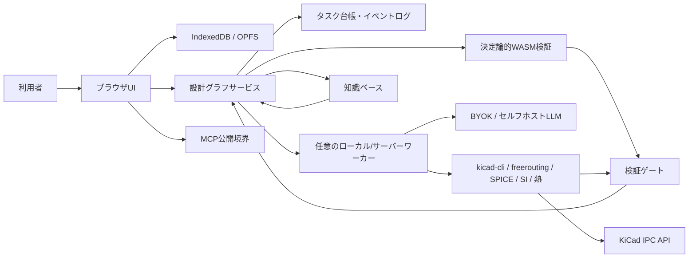

# ACD システムアーキテクチャ

**ステータス：Draft**

## 目的と権威範囲

本書は、READMEの「4. アーキテクチャの方向性」と「9. 長時間タスクを走り切る実行基盤」を実装へ落とすための境界を定義します。具体的な言語、フレームワーク、データベース、LLMプロバイダは未決定であり、[`adr/0006-implementation-language-storage.md`](adr/0006-implementation-language-storage.md)で扱います。

## 境界

### ブラウザUI

- 要件、設計グラフ、タスク台帳、差分、検証結果、停止理由を表示する。
- 軽量なパーサー、グラフ操作、差分計算、UI状態をブラウザで実行する。
- Web Workersで重い非同期処理をUIスレッドから分離する。
- 2D/3Dレンダリングは可能な範囲でOffscreenCanvasを使う。対応ブラウザとフォールバックは未決定。
- IndexedDBをメタデータ、イベント、チェックポイントのローカルキャッシュ候補、OPFSを大きな設計成果物のローカル保管候補とする。どちらを採用するか、また他のストレージとどう組み合わせるかは未決定（ADR-0006で決定）。

### 決定論的WASM層

トポロジー検査、軽量ERC/DRC、設計グラフのスキーマ検証、Gerber/IPC-2581の構造検査など、ブラウザで安全に実行できる検査をWASMまたは同等のサンドボックスで実行します。AIの出力を合否判定に使わず、同一入力・同一ツールバージョンから再現可能な結果を返します。これはtarget architectureであり、Phase 0/1では独自WASM engineを受入対象とせず、既存CLI、fixture runner、外部tool境界を使います。

### 任意のローカル／サーバーワーカー

ブラウザだけでは重い、長時間、または秘密情報を扱う処理をワーカーへ委譲できます。これはtarget architectureであり、Phase 0/1ではworker実装を受入対象とせず、既存CLI、fixture runner、外部tool境界を使います。

- ローカルLLMまたはサーバーLLM推論
- 大規模な自動配線
- 高忠実度SPICE、SI、熱解析
- openEMS、scikit-rf、Elmer、FreeCAD FEM等のSI／PI／熱解析ワーカー
- Renode、QEMU、Wokwi、Verilator等の仮想組込み／RTL検証ワーカー
- `kicad-cli`、freerouting、その他のネイティブツール
- 長時間ランのチェックポイント所有と再開

シミュレーションエンジンは用途とライセンス境界で層別します。ブラウザ内の小～中規模回路にはngspice WASMを候補とし、ローカル／サーバーワーカーではngspice共有ライブラリやXyceを候補とします。LTspiceとQSPICEは、利用者が個別にインストールした任意の外部検証器として扱い、本体やモデルをACDから再配布しません。外部検証の結果は、ネットリスト方言、エンジン版、モデル出所、入力ハッシュ、収束状態とともにEvidenceへ取り込みます。既定エンジンの版固定とWASM対応範囲は未決定です。

各エンジンのモデル、制御文、収束オプション、波形形式には差があるため、同一ネットリストを無条件に流用しません。重要な値については、必要に応じて複数エンジンのサニティ比較を任意ゲートとして実行します。シミュレータの詳細と検証境界は[`verification-gates.md`](verification-gates.md)を参照します。

ワーカーはブラウザが閉じてもランを継続でき、UIは再接続して状態を取得します。ワーカーを必須にするか、どのジョブを委譲するかは未決定です。

### LLMポリシー

BYOK（利用者自身のAPIキー）とセルフホストLLMを第一級の選択肢にします。ACDが利用者の設計データを、同意なく第三者の学習に提供することはありません。クラウド推論を使う場合は、送信範囲、保存期間、プロバイダ、機密性を明示し、プロジェクトデータと再利用可能な一般知識を分離します。

### チェックポイントと実行形態

- **ブラウザのみ：** IndexedDB/OPFS候補に設計グラフのリビジョン、イベント、タスク台帳、成果物のハッシュを保存する。タブを閉じると実行は一時停止し得るが、最後のチェックポイントから再開する。
- **ワーカーモード：** ワーカーがイベントログとチェックポイントの所有者となり、ブラウザは観測・操作端末となる。再接続時はグラフリビジョンとイベントIDから追いつく。
- **制約：** ブラウザのみのモードはタブ終了中に処理を進めません。ワーカーモードでは、ブラウザから切断してもワーカーが独立して継続します。
- 両モードは同じ型付きツール契約と検証ゲートを使い、モード差で合否が変わらないことを目標とする。

### MCP

ACDの要件取得、設計グラフ参照、候補生成、検証実行、差分表示、タスク状態取得を型付きMCP操作として公開できます。MCPクライアントからの操作も通常の認証、予算、承認ID、冪等性、監査ログを通過し、直接ファイルを書き換える抜け道を作りません。公開するツール一覧と認証方式は未決定です。

### KiCad境界

KiCadは相互運用・レビュー・退避先です。`kicad-cli`はバッチ検証・エクスポート、IPC APIは稼働中エディタへの検査・ガード付き変更を担当します。KiCad 10を最低対応にするか、KiCad 11の回路図IPCを必須にするかは未決定（[ADR-0007](adr/0007-kicad-minimum-version.md)で決定予定）です。Phase 0/1 CIは[ADR-0009](adr/0009-provisional-kicad-ci-baseline.md)の暫定基準に従います。回路図を正にせず設計グラフから投影します（詳細は[`kicad-interop.md`](kicad-interop.md)）。

### 機械CAD境界

MCADはKiCadと同じく、ACDの正規設計グラフに隣接する外部系です。ACDは筐体・取付・高さ・コネクタ・keepoutなどの機械制約をグラフへ取り込み、STEP、glTF、IDF、IDX、DXFを交換・レビュー用の投影として扱います。初期経路はSTEP/glTF/DXF/IDFの決定論的な入出力とし、IDXによる増分同期を最初から保証するかは未決定です。

FreeCADの`FreeCADCmd`/Pythonを任意のローカルワーカーで実行し、形状の妥当性、2D外形、3D干渉、クリアランスを決定論的に検査できます。FreeCAD MCP、Fusion MCP等のMCAD MCPはACD MCPの任意の型付きピアとして接続できますが、能力検出、スクリプト・CADバージョンの記録、再オープン、冪等性、読み取り／可逆／不可逆の操作分類を通します。

Phase 8のローカル製造では、`PrinterProfile`または`ManufacturingProfile`候補に機体だけでなく、導電性フィラメント・ペースト・インクの抵抗率、異方性、最小線幅・層厚、電流容量、基材適合性、硬化／焼結温度、密着性、耐久性を含め、材料依存のDRC入力にします。導電体を含む筐体や非平面の構造エレクトロニクスは将来方向であり、Phase 1の平面PCB実装へ持ち込みません。

## 関連文書

- [`design-graph.md`](design-graph.md)：正規状態とリビジョン
- [`pipeline.md`](pipeline.md)：ステップごとの状態遷移
- [`agent-runtime.md`](agent-runtime.md)：ワーカー、チェックポイント、再開
- [`repo-structure.md`](repo-structure.md)：package境界と依存方向
- [`tool-contract.md`](tool-contract.md)：型付きツール境界
- [`../README.md`](../README.md#4-アーキテクチャの方向性)

## コンポーネント図

## 未決定事項

ブラウザ内グラフDBの有無、イベントログの物理形式、ワーカーのキュー、認証、マルチユーザー同期、WASM実装言語、OffscreenCanvasのフォールバック、LLMルーティングは未決定です。候補を実装へ持ち込むときはADRを追加します。

ACD自身は、利用者の設計データを同意なく第三者の学習へ提供しない方針を持ちます。BYOKや外部LLMを選ぶ場合の送信・保持・学習利用は、利用者と各プロバイダの契約および設定が適用されます。

### KiCadツール責務

責務の詳細とバージョン別能力は[`kicad-interop.md`](kicad-interop.md)の能力表を正とします。
