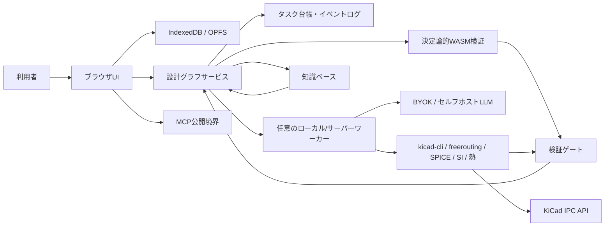

# ACD システムアーキテクチャ

**ステータス：Draft**

## 目的と権威範囲

本書は、READMEの「4. アーキテクチャの方向性」と「9. 長時間タスクを走り切る実行基盤」を実装へ落とすための境界を定義します。具体的な言語、フレームワーク、データベース、LLMプロバイダは未決定であり、[`adr/0006-implementation-language-storage.md`](adr/0006-implementation-language-storage.md)で扱います。

## 境界

### ブラウザUI

- 要件、設計グラフ、タスク台帳、差分、検証結果、停止理由を表示する。
- 軽量なパーサー、グラフ操作、差分計算、UI状態をブラウザで実行する。
- Web Workersで重い非同期処理をUIスレッドから分離する。
- 2D/3Dレンダリングは可能な範囲でOffscreenCanvasを使う。対応ブラウザとフォールバックは未決定。
- IndexedDBをメタデータ、イベント、チェックポイントのローカルキャッシュに使い、OPFSを大きな設計成果物のローカル保管候補とする。永続化方式の最終選定は未決定。

### 決定論的WASM層

トポロジー検査、軽量ERC/DRC、設計グラフのスキーマ検証、Gerber/IPC-2581の構造検査など、ブラウザで安全に実行できる検査をWASMまたは同等のサンドボックスで実行します。AIの出力を合否判定に使わず、同一入力・同一ツールバージョンから再現可能な結果を返します。

### 任意のローカル／サーバーワーカー

ブラウザだけでは重い、長時間、または秘密情報を扱う処理をワーカーへ委譲できます。

- ローカルLLMまたはサーバーLLM推論
- 大規模な自動配線
- 高忠実度SPICE、SI、熱解析
- `kicad-cli`、freerouting、その他のネイティブツール
- 長時間ランのチェックポイント所有と再開

ワーカーはブラウザが閉じてもランを継続でき、UIは再接続して状態を取得します。ワーカーを必須にするか、どのジョブを委譲するかは未決定です。

### LLMポリシー

BYOK（利用者自身のAPIキー）とセルフホストLLMを第一級の選択肢にします。ACDが利用者の設計データを、同意なく第三者の学習に提供することはありません。クラウド推論を使う場合は、送信範囲、保存期間、プロバイダ、機密性を明示し、プロジェクトデータと再利用可能な一般知識を分離します。

### チェックポイントと実行形態

- **ブラウザのみ：** IndexedDB/OPFSに設計グラフのリビジョン、イベント、タスク台帳、成果物のハッシュを保存する。タブ終了時に処理が中断され得るため、再開可能な境界を小さくする。
- **ワーカーモード：** ワーカーがイベントログとチェックポイントの所有者となり、ブラウザは観測・操作端末となる。再接続時はグラフリビジョンとイベントIDから追いつく。
- 両モードは同じ型付きツール契約と検証ゲートを使い、モード差で合否が変わらないことを目標とする。

### MCP

ACDの要件取得、設計グラフ参照、候補生成、検証実行、差分表示、タスク状態取得を型付きMCP操作として公開できます。MCPクライアントからの操作も通常の認証、予算、承認ID、冪等性、監査ログを通過し、直接ファイルを書き換える抜け道を作りません。公開するツール一覧と認証方式は未決定です。

### KiCad境界

KiCadは相互運用・レビュー・退避先です。生成物は`kicad-cli`でERC/DRCとエクスポートを検証し、稼働中のPCB編集セッションへの限定変更にはKiCad IPC APIを使います。回路図の書き込み経路は弱いため、回路図を正にせず設計グラフから投影します（詳細は[`kicad-interop.md`](kicad-interop.md)）。

## 関連文書

- [`design-graph.md`](design-graph.md)：正規状態とリビジョン
- [`pipeline.md`](pipeline.md)：ステップごとの状態遷移
- [`agent-runtime.md`](agent-runtime.md)：ワーカー、チェックポイント、再開
- [`../README.md`](../README.md#4-アーキテクチャの方向性)

## コンポーネント図

## 未決定事項

ブラウザ内グラフDBの有無、イベントログの物理形式、ワーカーのキュー、認証、マルチユーザー同期、WASM実装言語、OffscreenCanvasのフォールバック、LLMルーティングは未決定です。候補を実装へ持ち込むときはADRを追加します。
