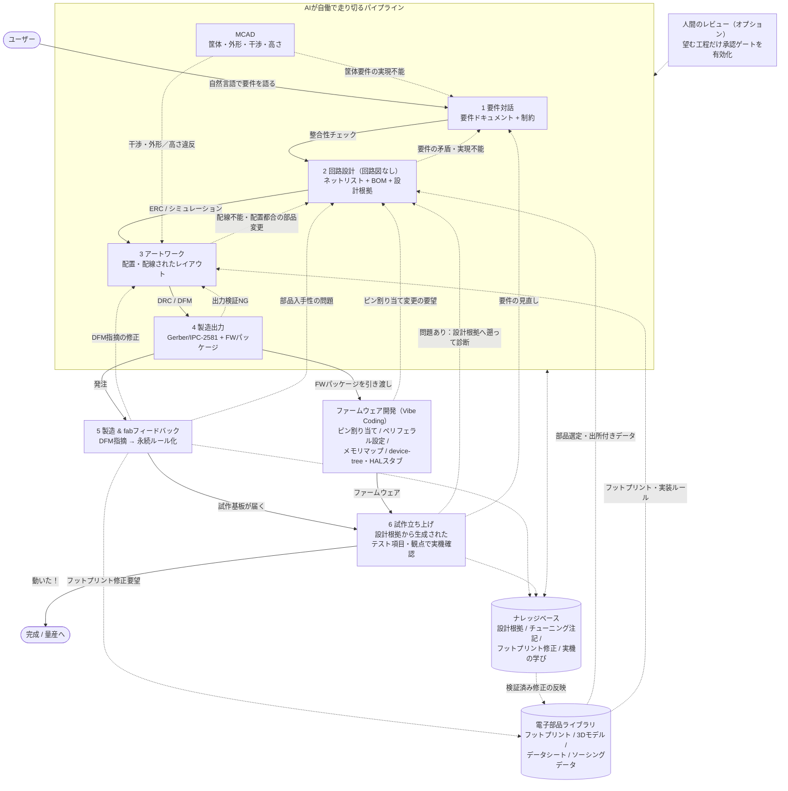

# 6ステップ設計パイプライン

**ステータス：Draft**

## 目的と権威範囲

READMEの「2. 設計フロー — 6つのステップ」と同じ状態遷移を、入力・出力・検証・知識化・停止条件として定義します。人間レビューは任意であり、検証ゲートと実機試験が既定の品質境界です。

本書は最終的なターゲット状態を定義します。README §7のPhase 1では、知識取得フックは追記専用イベントログへの記録に限定し、再利用可能な永続ナレッジベースへの書き戻しは行いません。永続的な知識ループはPhase 3から有効化します。Step 4の`FirmwarePackage`はターゲット状態の出力であり、Phase 1の受入条件と出力検証ゲートからは除外します。FW packageの実装・検証はPhase 6で扱います。

Phase 1の実装・受入境界は、事前に構造化された`Requirement` fixtureから開始します。自然言語入力、要件インタビュー、LLM/NLから`Requirement`への変換はPhase 1の実装対象外であり、Phase 5で別の入力adapterとして追加します。

MCAD連携と筐体・機械部品の外部製造は、Phase 1の必須実装ではなく、README Phase 9を中心とする将来スコープです。ターゲット状態ではStep 4がSTEP/glTFに加えてSTL/3MF等の製造用投影を生成し、3Dプリント・CNC・板金サービスの見積とDFMへ渡します。筐体注文も基板注文と同じ総発注額（基板fab、部品、実装、送料、税、筐体・機械部品）と発注前ゲートで扱い、checkoutは不可逆操作として同じ予算・承認ポリシーに従います。

実線はデフォルトの自動フロー、点線はフィードバックと知識の流れです。すべての段階がナレッジベースへ書き込み、そこから読み取ります。実装では各矢印をグラフリビジョンとイベントで記録します。

## ステップ仕様

| Step                           | 入力                                                                                                               | 出力                                                                             | 自動ゲート                                                             | 知識フック                                         |
| ------------------------------ | ------------------------------------------------------------------------------------------------------------------ | -------------------------------------------------------------------------------- | ---------------------------------------------------------------------- | -------------------------------------------------- |
| 1 要件インタビュー             | 自然言語、用途、予算、納期、製造条件、筐体・機械インターフェース                                                   | 構造化`Requirement`、制約、受入条件、未確定事項                                  | 要件の整合性、単位・範囲、必須情報、矛盾、外形・取付・高さの実現可能性 | 要件解釈、質問と回答、採用・却下理由               |
| 2 回路アーキテクチャ・部品選定 | 要件、機能ブロック、部品DB、証拠                                                                                   | `FunctionalBlock`、`Component`、`Part`、`Pin`、`Net`、BOM候補                    | ピン互換、電源・定格、在庫・ライフサイクル、トポロジー、SPICE          | 部品選定、代替、データシート注記、設計根拠         |
| 3 PCB配置・配線                | ネットリスト、電気制約、機械制約（外形、取付穴、keepout、最大高さ、コネクタ位置）、スタックアップ、fabプロファイル | `Layout`、配線候補、DRCレポート、MCAD向け3D投影候補                              | 接続完全性、DRC、2D機械クリアランス、3D干渉、SI/熱の必要性判定         | 配置・配線パターン、fab指摘、MCAD干渉・収まり不良  |
| 4 製造・FW出力                 | 検証済みレイアウト、部品、FW要件、MCAD境界                                                                         | `ManufacturingPackage`、`FirmwarePackage`、STEP/glTF等の3D基板モデル、テスト計画 | Gerber/IPC-2581/BOM/PnP構造、全ゲート、出力再読込、3D出力妥当性        | 出力変換、ツールバージョン、生成差分、MCADレビュー |
| 5 製造フィードバック           | fab DFM、価格、納期、組立報告                                                                                      | 構造化フィードバック、修正パッチ、知識候補                                       | フィードバックの設計ID照合、重複・信頼度、修正後DRC                    | fab固有ルール、フットプリント修正、標準候補        |
| 6 試作・FW/HW試験              | 基板、FWパッケージ、テスト項目、根拠                                                                               | 測定、合否、失敗原因、次の要件・設計パッチ                                       | 実測値、FWスモーク、電源・通信・機能試験                               | 実測、チューニング値、成功・失敗、標準更新         |

## フィードバック辺

- **3→2：** 配線不能、電源・SI制約、部品の物理制約からアーキテクチャを再検討する。
- **2→1：** 部品供給、性能、コストの不成立を要件の質問・再交渉へ戻す。
- **4→3：** 出力検査または製造パッケージの不整合をレイアウトへ戻す。
- **5→3：** fabのクリアランス、穴、パネル化指摘を配置・配線へ戻す。
- **5→2：** 部品代替、実装不可、納期から部品選定へ戻す。
- **6→2：** 実測した性能・発熱・部品不具合から回路へ戻す。
- **6→1：** 目的未達や使用条件の変化を要件へ戻す。
- **MCAD→3：** 干渉、外形、取付穴、keepout、最大高さの不成立を配置・配線へ戻す。
- **MCAD→1：** 筐体や機械インターフェース自体が実現不能な場合、要件へ戻す。
- **FW→2：** ピン競合、タイミング、ペリフェラル制約を回路へ戻す。

Step 1の要件インタビューでは、自由記述・回答・制約候補を親和図法でクラスタリングし、連関図法と系統図法で要求から機能・制約・部品・試験への関係を整理できます。Step 6の実機故障では、特性要因図を設計根拠、Evidence、工程、測定条件から生成し、候補原因を次の差分パッチへ接続します。これらは入力リビジョンを参照する分析投影であり、AIの推測だけで原因確定しません。手法の詳細は[`qc-tools.md`](qc-tools.md)を参照します。

### 差分開発とリスピン

試作、fab、MCAD、ファームウェア、実測から修正パッチが生じた場合、ACDは変更セットから相互影響を分析し、影響を受けるEntity、工程、検証ゲート、`TestItem`、`Rationale`を抽出します。差分ランでは影響範囲の再検証を優先し、不要な全工程の再実行を避けます。ただし、影響が不明なリンクや伝播規則の不足があれば、より広い再検証へフォールバックします。完全なゴールデンゲートによる全再検証も常に選択可能です。

変更影響レポートと相互影響マトリクス（変更点×影響先Entity／工程）は、対象リビジョンとパッチを参照する生成投影です。人間のレビューを有効にした場合は、任意のレビュー画面でマトリクスを提示します。検証結果は入力リビジョンに紐づき、影響を受けた結果はstaleとして下流へ流しません。

## ステップ完了の判定

ステップは、成果物生成、決定論的ゲートの合格、未クローズの指摘と未解消の`order-relevant` unknownがないこと、完了判定そのものの記録が揃ったときだけ完了とします。成果物を生成したレーンは自分の出力に合格を宣言せず、合否は決定論的ゲートの結果で決まります。

## 自働化（jidoka）停止条件

不合格ゲート、重大な不確実性、予算・納期超過、在庫消失、無進捗、同じ修正の振動、想定外の実測、不可逆操作の承認不足を検知したら、その場で停止します。停止通知には「何が、どこで、なぜ」を可視化し、既知の事実、不確実性、選択肢、推奨案、再開地点を示します。不良を次工程へ流しません。停止を閉じるときは、原因、影響範囲、処置区分、再開の入口条件、水平展開の要否を[`verification-gates.md`](verification-gates.md)に従って記録します。

## 人間の承認

承認ゲートは任意です。ただし利用者が明示的に有効化した工程では、その承認が必要です。レビューが任意であることは、設定済みの承認ゲート、免除、証拠要件を免除しません。発注前最終ゲートに合格した予算上限内の発注は、不可逆操作であっても承認IDなしで自動実行できます。予算上限を超える発注、ルール免除、その他に設定された承認ゲート、曖昧な要件では承認IDが必要です。承認は範囲、条件、期限を持ち、期限切れの承認は再取得します。

## 関連文書

- [`design-graph.md`](design-graph.md)：各ステップの正規入力・出力
- [`verification-gates.md`](verification-gates.md)：自動ゲートと停止通知
- [`agent-runtime.md`](agent-runtime.md)：チェックポイントとフィードバックの実行
- [`../README.md`](../README.md#2-設計フロー--6つのステップ)
